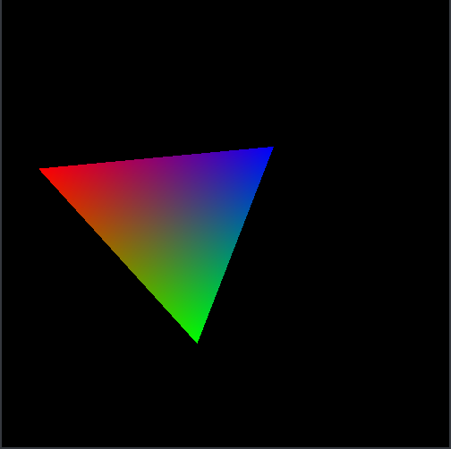

# Vulkan Triangle

Draws a triangle using the Vulkan API.
You can move the camera using the WASD keys to move, and the arrow keys to rotate.

There are utility functions to create and destroy Vulkan resources that may be found in `vulkan_helper.c`.

This software is released into the public domain and you can use it however you like.

This project has been largely inspired by the first few lessons found here:
<https://vulkan-tutorial.com>
